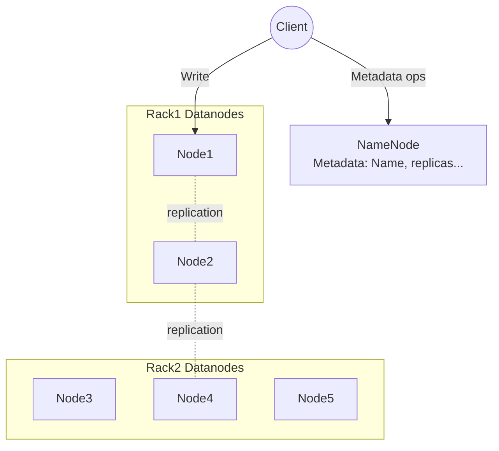
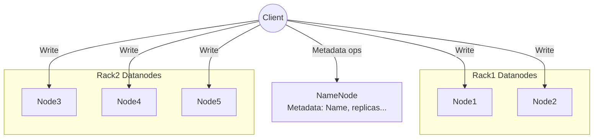
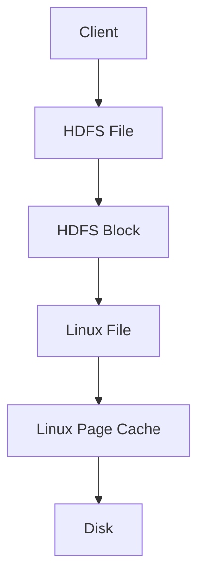
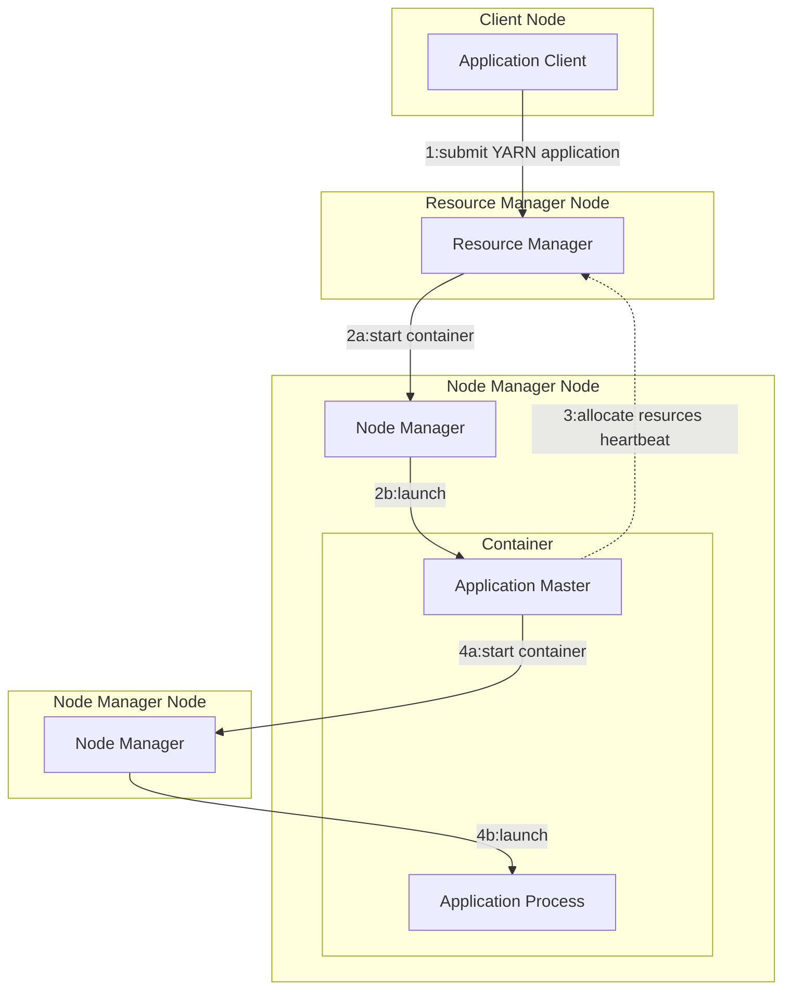
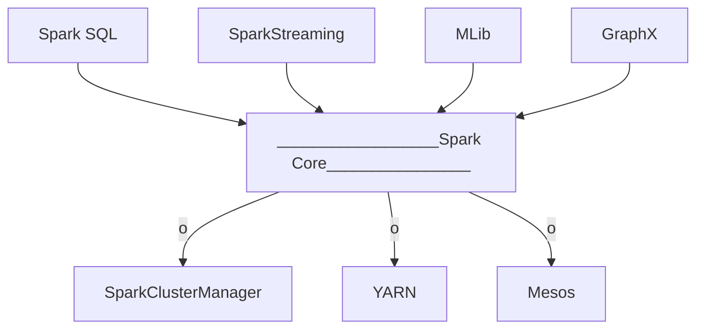
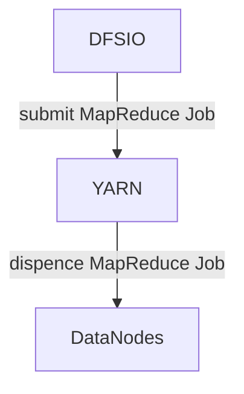

# 目标

HDFS Erasure Code与3复本性能对比，HDFS EC是否可以替代3复本，在什么场景下。

# HADOOP 知识

## Hadoop关键进程

hadoop集群中主要进程有
master:   NameNode, ResourceManager,
slaves:   DataNode, NodeManager,  RunJar, MRAppMaster,YarnChild

其中 RunJar, MRAppMaster,YarnChild与随着某个job的创建而创建，随着job的完成而终止。它们的作用分别是：
RunJar：完成job的初始化，包括获取jobID，将jar包上传至hdfs等。
MRAppMaster：每个job一个进程，主要跟踪job的运行情况，向RM申请资源等。
YarnChild：运行具体的map/reduce task。

job启动过程：
ResourceManage，NodeManager->RunJar->MRAppMaster->YarnChild

job退出过程：
YarnChild->MRAppMaster->RunJar
即所有的map/reduce均完成后，MRAppMaster才退出，最后RunJar退出，job完成。

## HDFS V1 设计的假设

* 廉价的磁盘存储（如今，数据量指数增长，而磁盘单位成本却未指数下降）
* 网络带宽是瓶颈（如今，局域网带宽达到20Gbps、100Gbps）

## HDFS 的数据存储

### HDFS 内存存储

### HDFS 异构存储

## HDFS 3复本

### HDFS 3复本写



#### 具体过程如下

1. Client调用DistributedFileSystem对象的create方法，创建一个文件输出流（FSDataOutputStream）对象
2. 通过DistributedFileSystem对象与Hadoop集群的NameNode进行一次RPC远程调用，在HDFS的Namespace中创建一个文件条目（Entry），该条目没有任何的Block
3. 通过FSDataOutputStream对象，向DataNode写入数据，数据首先被写入FSDataOutputStream对象内部的Buffer中，然后数据被分割成一个个Packet数据包
4. 以Packet最小单位，基于Socket连接发送到按特定算法选择的HDFS集群中一组DataNode（正常是3个）中的一个节点上，在这组DataNode组成的Pipeline上依次传输Packet
5. 这组DataNode组成的Pipeline反方向上，发送ack，最终由Pipeline中第一个DataNode节点将Pipeline ack发送给Client
6. 完成向文件写入数据，Client在文件输出流（FSDataOutputStream）对象上调用close方法，关闭流
7. 调用DistributedFileSystem对象的complete方法，通知NameNode文件写入成功。

#### DFSOutputStream内部原理

打开一个DFSOutputStream流，Client会写数据到流内部的一个缓冲区中，然后数据被分解成多个Packet，每个Packet大小为64k字节，每个Packet又由一组chunk和这组chunk对应的checksum数据组成，默认chunk大小为512字节，每个checksum是对512字节数据计算的校验和数据。
当Client写入的字节流数据达到一个Packet的长度，这个Packet会被构建出来，然后会被放到队列dataQueue中，接着DataStreamer线程会不断地从dataQueue队列中取出Packet，发送到复制Pipeline中的第一个DataNode上，并将该Packet从dataQueue队列中移到ackQueue队列中。ResponseProcessor线程接收从Datanode发送过来的ack，如果是一个成功的ack，表示复制Pipeline中的所有Datanode都已经接收到这个Packet，ResponseProcessor线程将packet从队列ackQueue中删除。
在发送过程中，如果发生错误，所有未完成的Packet都会从ackQueue队列中移除掉，然后重新创建一个新的Pipeline，排除掉出错的那些DataNode节点，接着DataStreamer线程继续从dataQueue队列中发送Packet。
下面是DFSOutputStream的结构及其原理，如图所示：


### HDFS 3复本读


#### 方式

HDFS目前实现的读操作有3个层次，分别是网络读、短路读(short circuit read)以及零拷贝读(zero copy read)，它们的读取效率依次递增。

1. 网络读：网络读是最基本的一种HDFS读，DFSClient和Datanode通过建立Socket连接传输数据。 
2. 短路读：当DFSClient和保存目标数据块的Datanode在同一个物理节点上时，DFSClient可以直接打开数据块副本文件读取数据，而不需要Datanode进程的转发。 
3. 零拷贝读：当DFSClient和缓存目标数据块的Datanode在同一个物理节点上时，DFSClient可以通过零拷贝的方式读取该数据块，大大提高了效率，而且即使在读取过程中该数据块被Datanode从缓存中移除了，该操作还可以退化为本地短路读，非常方便。

##### 短路读取

当客户端和Datanode在同一个机器上时，客户端就可以绕过Datanode进程，直接从本地磁盘上读取数据。 
当客户端向Datanode请求数据时，Datanode会打开文件以及该文件的元数据文件，将这两个文件的文件描述符通过domainSocket传给客户端，而不是将路径传给客户端。客户端拿到文件描述符后构造输入流，之后通过输入流直接读取磁盘上的块文件。通过这种方式直接绕过了Datanode进程的转发，提供了更好的读取性能。由于文件描述符时只读的，所以客户端不能修改收到的文件，同时由于客户端自身无法访问块文件所在的目录，所以它也就无法访问数据目录的其他文件了，从而提高了读数据的安全性。

UNIX domain Socket时一种进程间的通信方式，它使得同一台机器上的两个进程能够以Socket的方式进行通信。他带来的一大好处就是，两个进程除了可以传递普通数据外，还可以在进程间传递文件描述符。

短路读共享内存

了解了短路读取的概念之后，下边看看HDFS是如何实现这种模式的。在DFSClient中，使用ShortCircuitReplica类封装可以进行短路读取的副本。ShortCircuitReplica对象中包含了短路读取副本的数据块文件的输入流、校验文件输入流、短路读取副本在共享内存的槽位以及副本引用次数等信息。 

当DFSClient和Datanode在同一台机器上时，需要一个共享内存段来维护所有的短路读取副本的状态，共享内存段中会有很多个槽位，每个槽位都记录了一个短路读取副本的信息，例如当前副本是否有效、锚的次数（缓存中的引用计数次数）等。 

共享内存机制是由DFSClient和Datanode对同一个文件执行内存映射操作实现的。 

因为MappedByteBuffer对象能让内存与物理文件的数据实时同步，所以DFSClient和Datanode进程会通过中间文件来交换数据(什么中间文件?)，中间文件使得这两个进程的内存区域得到及时的同步。

##### 零拷贝读

When block has been cached by a DataNode, clients can use a new , more-efficient, zero-copy read API. Since checksum verification of cached data is done once by the DataNode, clients can incur essentially zero overhead when using this new API.

#### 配置

默认shortcircuit为false，手动开启

https://hadoop.apache.org/docs/r3.0.1/hadoop-project-dist/hadoop-hdfs/hdfs-default.xml

如何确认ShortCircuit的domain socket配置生效且在使用?

答: 测试读IO时，在DataNode结点netstat查看配置的domain socket文件是否建立链接，建立则OK

```
Active UNIX domain sockets (w/o servers)
Proto RefCnt Flags       Type       State         I-Node   Path
unix  3      [ ]         STREAM     CONNECTED     8364493  /var/lib/hadoop-hdfs/dn_socket  
unix  3      [ ]         STREAM     CONNECTED     8364504  /var/lib/hadoop-hdfs/dn_socket
unix  3      [ ]         STREAM     CONNECTED     16471    /run/systemd/journal/stdout
```

#### 疑问点

##### 短路读与零拷贝读是否依赖集中缓存的开启

从第三方分析测试来看，短路读不依赖于集中缓存功能的开启，但其可能存储不命中的情况，因其没锁定，操作系统随时可以回收文件系统某些文件(HDFS块)的缓存。https://blog.csdn.net/Pun_C/article/details/44118095

而集中缓存除了需要通过命令行对指定目录文件开启缓存以锁定不被操作系统回收，还需要在xml配置使用内存大小，hdfs-site.xml `dfs.datanode.max.locked.memory`。

短路读具体细节还有待分析。

#### 测试指标偏低

可能原因：

* 系统部分参数上限配置，如ulimit
* Hadoop的配置
* Hadoop 3.0.0 的bug

### HDFS 3复本计算

### HDFS 3复本恢复

## HDFS Erasure Code

### HDFS EC设计

由这篇issue提出 https://issues.apache.org/jira/browse/HDFS-7285

### HDFS EC实现

参考英特尔的人写的实现说明: http://geek.csdn.net/news/detail/77338

```java
/**
 * When accessing a file in striped layout, operations on logical byte ranges
 * in the file need to be mapped to physical byte ranges on block files stored
 * on DataNodes. This utility class facilities this mapping by defining and
 * exposing a number of striping-related concepts. The most basic ones are
 * illustrated in the following diagram. Unless otherwise specified, all
 * range-related calculations are inclusive (the end offset of the previous
 * range should be 1 byte lower than the start offset of the next one).
 *
 *  | <----  Block Group ----> |   <- Block Group: logical unit composing
 *  |                          |        striped HDFS files.
 *  blk_0      blk_1       blk_2   <- Internal Blocks: each internal block
 *    |          |           |          represents a physically stored local
 *    v          v           v          block file
 * +------+   +------+   +------+
 * |cell_0|   |cell_1|   |cell_2|  <- {@link StripingCell} represents the
 * +------+   +------+   +------+       logical order that a Block Group should
 * |cell_3|   |cell_4|   |cell_5|       be accessed: cell_0, cell_1, ...
 * +------+   +------+   +------+
 * |cell_6|   |cell_7|   |cell_8|
 * +------+   +------+   +------+
 * |cell_9|
 * +------+  <- A cell contains cellSize bytes of data
 */
@InterfaceAudience.Private
public class StripedBlockUtil {
```


```java
/**
* Indicates the coverage of an {@link AlignedStripe} on an internal block,
* and the state of the chunk in the context of the read request.
*
* |<---------------- Striped Block Group --------------->|
*   blk_0        blk_1        blk_2          blk_3   blk_4
*                           +---------+  |  +----+  +----+
*     null         null     |REQUESTED|  |  |null|  |null| <- AlignedStripe0
*              +---------+  |---------|  |  |----|  |----|
*     null     |REQUESTED|  |REQUESTED|  |  |null|  |null| <- AlignedStripe1
* +---------+  +---------+  +---------+  |  +----+  +----+
* |REQUESTED|  |REQUESTED|    ALLZERO    |  |null|  |null| <- AlignedStripe2
* +---------+  +---------+               |  +----+  +----+
* <----------- data blocks ------------> | <--- parity --->
*/
public static class StripingChunk {
```

### HDFS EC疑问点

* 是否有短路读/本地读?
* 数据如何从DFSClient组织发往DataNode，也是像3复本一样以64k Packet发送? 是的，重命名为DFSPacket。
* 恢复丢失的块(3复本与EC)在哪恢复?  是在源节点(有数据的节点上恢复)，然后再写入目标节点。
* 一个文件，EC的块组未写满HDFS的内部块，这些内部块能否用于其它文件? 不可以，内部块ID从EC块组的ID生成的，即有强关联。这样的话，对于小文件，内部块就不会写满了。(待验证)

### HDFS Erasure Code写

以RS-3-2-1024k为例。



### HDFS Erasure Code读

### HDFS Erasure Code计算

### HDFS Erasure Code恢复

## HDFS I/O 写路径

其中，

HDFS Cache Management 实际是控制Block在Linux File中的缓存是否开启并锁定。

同时Linux层用的是Page Cache而不是Buffer Cache，因为HDFS是使用Linux文件系统而不是裸盘。



## HDFS DFSClient

### 传输的数据包

1. 数据在HDFS上存储的基本单位是Block，默认大小64M；


2. 数据在Client和DataNode之间传输数据的基本单位是Packet，默认最大为64k；
3. 每个Packet又由一组chunk和这组chunk对应的checksum组成，默认chunk大小为512字节，每个checksum是对512字节数据计算的校验和数据。
4. 数据传输Pipeline，宏观上看是Block Pipeline，但是微观上其实是Packet Pipeline。

参考: http://shiyanjun.cn/archives/942.html

## 缓存

HDFS的缓存与我们平常所说的缓存(cache)在作用上是一致的，主要是为了减少重复的数据请求过程。但，与平常的缓冲数组不一样，其是缓存块(cache block)的概念。HDFS的缓存块由普通的文件块转换而来，同样也可以转换回去。HDFS缓存的出现可以大大提高用户读取文件的速度，因为它是缓存在DataNode的内存中的，此过程无需进行读取磁盘的操作。

### HDFS集中式缓存

集中式缓存(Centralized Cache Management)，该特性能够让用户显式地把某些HDFS文件强制映射到内存中，防止被操作系统换出内存页，提高内存利用效率，有效加快文件访问速度。对于Hive来说，如果对某些SQL查询里需要经常读取的表格文件进行缓存，通常能够提升运行效率。

集中缓存有两层概念：

1. 第一层是缓存，即为存储在HDFS中文件提供缓存的机制，从而可以加速DFSClient对文件的读操作；
2. 第二层概念是集中式的管理，传统的HDFS缓存依赖了OS本身的缓存机制，但是这种缓存机制不能被管理员或中央节点进行管理，不能自由的控制哪些文件缓存，哪些文件不进行缓存；集中式的管理可以提高了对缓存内存的可控性；

NameNode主要负责协调所有DataNode的堆外内存。DataNode会按照一定的时间间隔通过heartbeat向NameNode汇报所缓存的文件block块记录。NameNode会接收用户的命令：缓存或清空某个路径的缓存，然后通过heartbeat通知含有对应文件block的DataNode进行缓存。

​    NameNode提供一个缓存池（cache pools）来方便管理缓存命令（cache directives），缓存命令负责决定具体进行缓存的路径。

​    目前缓存只能够在文件夹或者文件的粒度进行控制。文件块和子块缓存仍然在计划开发中。


### 集中式缓存的开启

涉及多个步骤

* 命令指定目录/文件使用缓存
* 配置 hdfs-site.xml `dfs.datanode.max.locked.memory`，默认为0
* 配置Linux的ulimit

参考: https://blog.csdn.net/androidlushangderen/article/details/51469877

## MapReduce

### mapreduce.framework.name

mepred-site.yml

```xml
<configuration>
	<property>
		<name>mapreduce.framework.name</name>
		<value>yarn</value>
	</property>
</configuration>
```

The runtime framework for executing MapReduce jobs. Can be one of local, classic or yarn. 默认是local。

`yarn` stands for MRv2. `classic` is for MRv1 and `local` for local runs of the MR jobs. 

`classic` is MR1, whenever we submit MR jobs using framework name as classic, Job will be submitted to Jobtracker daemon in MR1 which will coordinate the MapReduce execution, each tasks will be executed in different JVMs.

Whereas the main purpose of `local` JobRunner is debugging/testing MapReduce program with **small inputs**. It doesn't need any daemons like JobTracker, TaskTracker. This execution mode is useful when you execute any MR application from **eclipse**, by default execution will be in local jobrunner(Uses the same JVM that eclipse use). All mapper/reduce will be executing the same JVM. As the same JVM is being used for all executions(Driver+Map+Reduce), one cannot use this for processing large data, execution will end up with **OutOfMemory** exception.

### MapReduceV1

MapReduceV1架构


MapReduceV1 程序的流程及设计思路：

1. 首先用户程序 (JobClient) 提交了一个 job，job 的信息会发送到 Job Tracker 中，Job Tracker 是 Map-reduce 框架的中心，他需要与集群中的机器定时通信 (heartbeat)，需要管理哪些程序应该跑在哪些机器上，需要管理所有 job 失败、重启等操作。
2. TaskTracker 是 Map-reduce 集群中每台机器都有的一个部分，他做的事情主要是监视自己所在机器的资源情况。
3. TaskTracker 同时监视当前机器的 tasks 运行状况。TaskTracker 需要把这些信息通过 heartbeat 发送给 JobTracker，JobTracker 会搜集这些信息以给新提交的 job 分配运行在哪些机器上。上图虚线箭头就是表示消息的发送 - 接收的过程。

可以看得出原来的 map-reduce 架构是简单明了的，在最初推出的几年，也得到了众多的成功案例，获得业界广泛的支持和肯定，但随着分布式系统集群的规模和其工作负荷的增长，原框架的问题逐渐浮出水面，主要的问题集中如下：

1. JobTracker 是 Map-reduce 的集中处理点，存在单点故障。
2. JobTracker 完成了太多的任务，造成了过多的资源消耗，当 map-reduce job 非常多的时候，会造成很大的内存开销，潜在来说，也增加了 JobTracker fail 的风险，这也是业界普遍总结出老 Hadoop 的 Map-Reduce 只能支持 4000 节点主机的上限。
3. 在 TaskTracker 端，以 map/reduce task 的数目作为资源的表示过于简单，没有考虑到 cpu/ 内存的占用情况，如果两个大内存消耗的 task 被调度到了一块，很容易出现 OOM。
4. 在 TaskTracker 端，把资源强制划分为 map task slot 和 reduce task slot, 如果当系统中只有 map task 或者只有 reduce task 的时候，会造成资源的浪费，也就是前面提过的集群资源利用的问题。
5. 源代码层面分析的时候，会发现代码非常的难读，常常因为一个 class 做了太多的事情，代码量达 3000 多行，，造成 class 的任务不清晰，增加 bug 修复和版本维护的难度。
6. 从操作的角度来看，现在的 Hadoop MapReduce 框架在有任何重要的或者不重要的变化 ( 例如 bug 修复，性能提升和特性化 ) 时，都会强制进行系统级别的升级更新。更糟的是，它不管用户的喜好，强制让分布式集群系统的每一个用户端同时更新。这些更新会让用户为了验证他们之前的应用程序是不是适用新的 Hadoop 版本而浪费大量时间。

### MapReduceV2

MapReduceV2架构


从业界使用分布式系统的变化趋势和 hadoop 框架的长远发展来看，MapReduce 的 JobTracker/TaskTracker 机制需要大规模的调整来修复它在可扩展性，内存消耗，线程模型，可靠性和性能上的缺陷。在过去的几年中，hadoop 开发团队做了一些 bug 的修复，但是最近这些修复的成本越来越高，这表明对原框架做出改变的难度越来越大。

为从根本上解决旧 MapReduce 框架的性能瓶颈，促进 Hadoop 框架的更长远发展，从 0.23.0 版本开始，Hadoop 的 MapReduce 框架完全重构，发生了根本的变化。新的 Hadoop MapReduce 框架命名为 MapReduceV2 或者叫 Yarn。

重构根本的思想是将 JobTracker 两个主要的功能分离成单独的组件，这两个功能是资源管理和任务调度 / 监控。新的资源管理器全局管理所有应用程序计算资源的分配，每一个应用的 ApplicationMaster 负责相应的调度和协调。一个应用程序无非是一个单独的传统的 MapReduce 任务或者是一个 DAG( 有向无环图 ) 任务。ResourceManager 和每一台机器的节点管理服务器能够管理用户在那台机器上的进程并能对计算进行组织。

事实上，每一个应用的 ApplicationMaster 是一个详细的框架库，它结合从 ResourceManager 获得的资源和 NodeManager 协同工作来运行和监控任务。

上图中 ResourceManager 支持分层级的应用队列，这些队列享有集群一定比例的资源。从某种意义上讲它就是一个纯粹的调度器，它在执行过程中不对应用进行监控和状态跟踪。同样，它也不能重启因应用失败或者硬件错误而运行失败的任务。

ResourceManager 是基于应用程序对资源的需求进行调度的 ; 每一个应用程序需要不同类型的资源因此就需要不同的容器。资源包括：内存，CPU，磁盘，网络等等。可以看出，这同现 Mapreduce 固定类型的资源使用模型有显著区别，它给集群的使用带来负面的影响。资源管理器提供一个调度策略的插件，它负责将集群资源分配给多个队列和应用程序。调度插件可以基于现有的能力调度和公平调度模型。

上图中 NodeManager 是每一台机器框架的代理，是执行应用程序的容器，监控应用程序的资源使用情况 (CPU，内存，硬盘，网络 ) 并且向调度器汇报。

每一个应用的 ApplicationMaster 的职责有：向调度器索要适当的资源容器，运行任务，跟踪应用程序的状态和监控它们的进程，处理任务的失败原因。

### MapReduceV1与MapReduceV2对比

新旧 MapReduce 框架做详细的分析和对比，可以看到有以下几点显著变化：

首先客户端不变，其调用 API 及接口大部分保持兼容，这也是为了对开发使用者透明化，使其不必对原有代码做大的改变 ( 详见 [2.3 Demo 代码开发及详解](https://www.ibm.com/developerworks/cn/opensource/os-cn-hadoop-yarn/#_2.3_Demo%20%E4%BB%A3%E7%A0%81%E5%BC%80%E5%8F%91%E5%8F%8A%E8%AF%A6%E8%A7%A3))，但是原框架中核心的 JobTracker 和 TaskTracker 不见了，取而代之的是 ResourceManager, ApplicationMaster 与 NodeManager 三个部分。

详细解释这三个部分，首先 ResourceManager 是一个中心的服务，它做的事情是调度、启动每一个 Job 所属的 ApplicationMaster、另外监控 ApplicationMaster 的存在情况。Job 里面所在的 task 的监控、重启等等内容不见了。这就是 AppMst 存在的原因。ResourceManager 负责作业与资源的调度。接收 JobSubmitter 提交的作业，按照作业的上下文 (Context) 信息，以及从 NodeManager 收集来的状态信息，启动调度过程，分配一个 Container 作为 App Mstr

NodeManager 功能比较专一，就是负责 Container 状态的维护，并向 RM 保持心跳。

ApplicationMaster 负责一个 Job 生命周期内的所有工作，类似老的框架中 JobTracker。每一个 Job（不是每一种）都有一个 ApplicationMaster，它可以运行在 ResourceManager 以外的机器上。

Yarn 框架相对于老的 MapReduce 框架什么优势呢？我们可以看到：

1. 这个设计大大减小了 JobTracker（也就是现在的 ResourceManager）的资源消耗，并且让监测每一个 Job 子任务 (tasks) 状态的程序分布式化了，更安全、更优美。
2. 在新的 Yarn 中，ApplicationMaster 是一个可变更的部分，用户可以对不同的编程模型写自己的 AppMst，让更多类型的编程模型能够跑在 Hadoop 集群中，可以参考官方模板配置(应该是mapreduce.framework.name)。
3. 对于资源的表示以CPU/内存为单位，比之前以剩余 slot 数目更合理。
4. 老的框架中，JobTracker 一个很大的负担就是监控 job 下的 tasks 的运行状况，现在，这个部分就扔给 ApplicationMaster 做了，而 ResourceManager 中有一个模块叫做 ApplicationsMasters( 注意不是 ApplicationMaster)，它是监测 ApplicationMaster 的运行状况，如果出问题，会将其在其他机器上重启。
5. Container 是 Yarn 为了将来作资源隔离而提出的一个框架。这一点应该借鉴了 Mesos 的工作，目前是一个框架，仅仅提供 java 虚拟机内存的隔离，hadoop 团队的设计思路应该后续能支持更多的资源调度和控制 ，既然资源表示成内存量，那就没有了之前的 map slot/reduce slot 分开造成集群资源闲置的尴尬情况。

新的 Yarn 框架相对旧 MapRduce 框架而言，其配置文件 , 启停脚本及全局变量等也发生了一些变化。https://www.ibm.com/developerworks/cn/opensource/os-cn-hadoop-yarn/

### mapred-site.xml配置

`mapred.tasktracker.map.tasks.maximum` 与 `mapred.tasktracker.reduce.tasks.maximum` 是配置每个DataNode的MapReduce并发，两个之和为`CPU线程数-2`一般情况下为最佳。

```xml
<property>
    <name>mapred.tasktracker.map.tasks.maximum</name>
    <value>15</value>
    <description>The maximum number of map tasks that will be run simultaneously by a task tracker.</description>
</property>
<property>
    <name>mapred.tasktracker.reduce.tasks.maximum</name>
    <value>15</value>
    <description>The maximum number of reduce tasks that will be run simultaneously by a task tracker.</description>
</property>
<property>
    <name>mapred.map.tasks</name>
    <value>10</value>
    <description>The default number of map tasks per job. Ignored when mapred.job.tracker is "local".</description>
</property>
```

### 从MR1迁移至Yarn

Migrating to MapReduce 2 on YARN (For Operators)

http://blog.cloudera.com/blog/2013/11/migrating-to-mapreduce-2-on-yarn-for-operators/

## YARN详解

### MapReduce与YARN关系

At their core, the improvements separate cluster resource management capabilities from MapReduce-specific logic. 

YARN并不是MapReduceV2，侧重于资源调度管理。YARN 是 Hadoop 2 开始使用的资源管理框架，Hadoop 1 的资源管理功能集成在 MapReduce 逻辑内部（资源管理只能为 MapReduce 作业服务），通常称第一代 MapReduce 为 “MRv1”，可以说，YARN 是 MRv1 的一部分功能 —— 主要职责是取代 MRv1 中 JobTracker 实现资源调度和作业管理分离，更加科学和高效地利用计算资源，有点像 Mesos 分布式资源管理系统。其中，作业管理由 ApplicationMaster （AM）实现，而 YARN 的资源管理方面，提供了计算资源管理和分配功能，对内存和磁盘等资源可以有效地管理。 它并不是下一代 MapReduce（MRv2），YARN 的其中一部分功能可以简单地认为是 MRv1 中一部分功能的代替者。实际上，YARN 是独立存在的，具有通用性，不仅可以调度 MapReduce 作业，还可以作为其他计算框架的资源管理框架，如 Spark、Storm 等可以跑在 YARN 上，它们通过 YARN 来管理计算资源，计算任务有了稳定的平台支撑，可以保证性能和稳定性，同时，这些计算框架可以方便地读取 HDFS 上的数据；

* 两者最大的关系应该是data locality， 也就是说YARN在调度资源时，能够根据HDFS中数据的位置来采取不同的策略。最大的应用是在mapredcue中，如果yarn把mapper放在数据所在的节点，那么省去了网络传输数据的开销，直接读本地数据就可以。
* YARN在做localization时，需要用到HDFS。比如App的jar files、DFClient、数据, YARN client 先把它们放到HDFS上，每次启动ApplicationMaster, mapper, reducer时，从HDFS短路下载，这个过程叫localization. 可以想象一个没有HDFS的YARN，localization很可能会遇到性能瓶颈，如果你从一个地方下载，或者你需要实现一个复杂的类似HDFS的系统。当然HDFS并不是一个localization最优的解决方案。（其它方案是啥?）

### YARN应用的运行机制

​	YARN通过两类长期运行的守护进程提供自己的核心服务：管理集群上资源使用的资源管理器(resource manager)、运行在集群中所有节点上且能够启动和监控容器(container)的节点管理器(node manager)。容器用于执行特定应用程序的进程，每个容器都有资源限制(内存，CPU等)。一个容器可以是一个Unix进程，也可以是一个Linux cgroup，取决于YARN的配置。下图描述了YARN是如何运行一个应用的。




为了在YARN上运行一个应用，首先，客户端联系资源管理器，要求它运行一个Application Master进程。然后，资源管理器找到一个能够在容器中启动Application Master的节点管理器。准确地说，Application一旦运行起来后，能做什么依赖于应用本身。有可能是在气息的容器中简单地运行一个计算，并将结果返回给客户端；或是向资源管理器请求更多的容器，以用于运行一个分布式计算。后者是MapReduce YARN应用所做的事情。

### 资源请求

YARN有一个灵活的资源请求模型。当请求多个容器时，可以指定每个容器需要的计算机资源数量(内存和CPU)，还可以指定对容器的本地限制要求。

本地化对于确保分布式数据处理算法高效使用集群带宽非常重要，因此，YARN允许一个应用为所申请的容器指定本地限制。本地限制可用于申请位于指定节点或机架、或集群中任何位置(机架之外)的容器。

有时本地限制无法满足，这种情况下要么不分配资源，或者可选择放松限制。例如，一个节点由于已经运行了别的容器无法再启动新的容器，这里如果有应用请求该节点，则YARN将尝试在同一机架中的其它节点上启动一个容器，如果还不行，则会尝试集群中的任何一个节点。

通常情况下，当启动一个容器用于处理HDFS数据块(为了在MapReduce中运行一个map任务)时，应用将会向这样的节点申请容器：存储该数据块三个复本的节点，或是存储这些复本的机架中的一个节点。如果都申请失败，则申请集群中的任意节点。

### YARN中的调度

YARN中有三种调度器可用：FIFO高度器(FIFO Scheduler)，容量调度器(Capacity Scheduler)和公平调度器(Fair Scheduler)。

## MapReduce, Spark, YARN, and HDFS关系

如下图


http://dataottam.com/2016/06/02/relationship-between-mapreduce-spark-yarn-and-hdfs/

## 小文件压缩

Hadoop MapReduce处理海量小文件：压缩文件

在HDFS上存储文件，大量的小文件是非常消耗NameNode内存的，因为每个文件都会分配一个文件描述符，NameNode需要在启动的时候加载全部文件的描述信息，所以文件越多，对NameNode来说开销越大。

我们可以考虑，将小文件压缩以后，再上传到HDFS中，这时只需要一个文件描述符信息，自然大大减轻了NameNode对内存使用的开销。MapReduce计算中，Hadoop内置提供了如下几

种压缩格式：

- DEFLATE

- gzip
- bzip2
- LZO
- snappy

使用压缩文件进行MapReduce计算，它的开销在于解压缩所消耗的时间，在特定的应用场景中这个也是应该考虑的问题。不过对于海量小文件的应用场景，我们压缩了小文件，却换来的Locality特性。

假如成百上千的小文件压缩后只有一个Block，那么这个Block必然存在一个DataNode节点上，在计算的时候输入一个InputSplit，没有网络间传输数据的开销，而且是在本地进行

运算。倘若直接将小文件上传到HDFS上，成百上千的小Block分布在不同DataNode节点上，为了计算可能需要“移动数据”之后才能进行计算。文件很少的情况下，除了NameNode内

存使用开销以外，可能感觉不到网络传输开销，但是如果小文件达到一定规模就非常明显了。

### 开启小文件压缩

TODO

## FsImage

使用FsImage查看追踪块存储位置等信息。

# Spark

Spark软件栈



Spark Core实现了Spark的基本功能，包含任务调度、内存管理、错误恢复、与存储系统交互等模块。Spark Core中还包含了对弹性分布式数据集(resilient distributed datase，RDD)的API定义。

Spark支持在各种集群管理器上运行，包括YARN、Mesos，以及自带的简易调度器。

# HBase

TODO

# Linux文件系统

## Linux Storage Stack


## Page Cache与Buffer Cache区别

page cahce 缓存了页面用来优化文件I/O, buffer cache 缓存了磁盘块用来优化 block I/O.在linux kernel 2.4之前，这两个缓存是不同的： 文件在page cache里， 磁盘块在buffer cache里. 这样某些系统调用(mmap)数据需要在两层cache中都保存了一份. 许多unix系统都遵循类似的模式. 这样很容易实现， 但是看起来很不优雅和低效, 从linux 2.4开始两种cache开始统一起来. VM子系统接管了I/O读写和页面缓存, 如果缓存的数据是一个文件内容（大多数据都是这样）这时buffer cache指向了page cache，也就是说数据只存在一份，buffer cache向硬盘发起读请求时数据会直接写入到 page cache中,因为指向了同一地址. page cache 就可以简单看做磁盘的一层缓存.

buffer cache 也会独立存在， 因为内核有时候需要普通小的block I/O 而不是以页为单位读写，硬盘大多数是文件内容的读写(以页为单位)， 此时buffer cache复用了page cache的内存, 但是有些少量的数据并不是文件内容例如：文件元数据(inode,dentry等)和原始块 I/O, 这种情况下的磁盘缓存则通过buffer cache 实现.
关于上面的一段历史可以参照 : https://www.usenix.org/legacy/event/usenix2000/freenix/full_papers/silvers/silvers_html/

https://www.quora.com/What-is-the-difference-between-Buffers-and-Cached-columns-in-proc-meminfo-output

### 示例

下图为系统内存状态，其中的`Cached`为Page Cache，`Buffers`为Buffer Cache。

```
| Memory and Swap -------------------------------------------------------------|
| PageSize:4KB   RAM-Memory  Swap-Space       High-Memory     Low-Memory       |
| Total (MB)       128651.5      4096.0       - not in use   - not in use      |
| Free  (MB)       117679.9      4096.0                                        |
| Free Percent         91.5%      100.0%                                       |
| Linux Kernel Internal Memory (MB)                                            |
|                        Cached=    8461.9     Active=    1617.2               |
| Buffers=     300.0 Swapcached=       0.0  Inactive =    7981.5               |
| Dirty  =    3542.0 Writeback =       0.0  Mapped   =      46.6               |
| Slab   =     378.6 Commit_AS =    3798.1 PageTables=       7.6               |
```

#### 写文件

```
# before
# sync; echo 1 > /proc/sys/vm/drop_caches
│ Memory and Swap ───────────────────────────────────────────────────────────────────────│
│ PageSize:4KB   RAM-Memory  Swap-Space       High-Memory     Low-Memory                 │
│ Total (MB)       112524.6      4096.0       - not in use   - not in use                │
│ Free  (MB)       111287.0      4096.0                                                  │
│ Free Percent         98.9%      100.0%                                                 │
│ Linux Kernel Internal Memory (MB)                                                      │
│                        Cached=      46.8     Active=      64.3                         │
│ Buffers=       0.0 Swapcached=       0.0  Inactive =      32.2                         │
│ Dirty  =       0.0 Writeback =       0.0  Mapped   =      39.6                         │
│ Slab   =     223.6 Commit_AS =     275.9 PageTables=       3.8                  

# dd if=/dev/zero of=~/test bs=4k count=256k 
# 过程中，可以看到 Cached与Dirty都增加了，而Buffers不变
│ Memory and Swap ───────────────────────────────────────────────────────────────────────│
│ PageSize:4KB   RAM-Memory  Swap-Space       High-Memory     Low-Memory                 │
│ Total (MB)       112524.6      4096.0       - not in use   - not in use                │
│ Free  (MB)       110226.3      4096.0                                                  │
│ Free Percent         98.0%      100.0%                                                 │
│ Linux Kernel Internal Memory (MB)                                                      │
│                        Cached=    1071.2     Active=      68.5                         │
│ Buffers=       0.0 Swapcached=       0.0  Inactive =    1056.4                         │
│ Dirty  =     896.0 Writeback =     128.0  Mapped   =      39.6                         │
│ Slab   =     251.7 Commit_AS =     282.9 PageTables=       3.9                         │
```

#### 写裸盘

```
# before
# sync; echo 1 > /proc/sys/vm/drop_caches
│ Memory and Swap ───────────────────────────────────────────────────────────────────────│
│ PageSize:4KB   RAM-Memory  Swap-Space       High-Memory     Low-Memory                 │
│ Total (MB)       112524.6      4096.0       - not in use   - not in use                │
│ Free  (MB)       111287.0      4096.0                                                  │
│ Free Percent         98.9%      100.0%                                                 │
│ Linux Kernel Internal Memory (MB)                                                      │
│                        Cached=      46.8     Active=      64.3                         │
│ Buffers=       0.0 Swapcached=       0.0  Inactive =      32.2                         │
│ Dirty  =       0.0 Writeback =       0.0  Mapped   =      39.6                         │
│ Slab   =     223.6 Commit_AS =     275.9 PageTables=       3.8                  

# dd if=/dev/zero of=/dev/sdc bs=4k count=256k
# 过程中，可以看到 Buffers与Dirty都增加了，而Cached不变。
# 因为直接写块设备，不经过一般的文件系统，所以Cached不变，

│ Memory and Swap ───────────────────────────────────────────────────────────────────────│
│ PageSize:4KB   RAM-Memory  Swap-Space       High-Memory     Low-Memory                 │
│ Total (MB)       112524.6      4096.0       - not in use   - not in use                │
│ Free  (MB)       110222.7      4096.0                                                  │
│ Free Percent         98.0%      100.0%                                                 │
│ Linux Kernel Internal Memory (MB)                                                      │
│                        Cached=      47.3     Active=      68.6                         │
│ Buffers=    1024.0 Swapcached=       0.0  Inactive =    1056.5                         │
│ Dirty  =     832.8 Writeback =      73.8  Mapped   =      39.6                         │
│ Slab   =     255.9 Commit_AS =     282.9 PageTables=       3.9                         │

# end 为何写完后，Buffers不会像Cached一样，会缓存写入的块？什么情况下会缓存Buffers，读的时候？

│ Memory and Swap ───────────────────────────────────────────────────────────────────────│
│ PageSize:4KB   RAM-Memory  Swap-Space       High-Memory     Low-Memory                 │
│ Total (MB)       112524.6      4096.0       - not in use   - not in use                │
│ Free  (MB)       111274.8      4096.0                                                  │
│ Free Percent         98.9%      100.0%                                                 │
│ Linux Kernel Internal Memory (MB)                                                      │
│                        Cached=      49.5     Active=      68.8                         │
│ Buffers=       0.0 Swapcached=       0.0  Inactive =      34.4                         │
│ Dirty  =       0.0 Writeback =       0.0  Mapped   =      39.6                         │
│ Slab   =     225.1 Commit_AS =     282.1 PageTables=       3.9       
```

### PageCache内容查看
查看测试文件在Page Cache缓存的信息。
```
# vmtouch ~/test 
           Files: 1
     Directories: 0
  Resident Pages: 262144/262144  1G/1G  100%
         Elapsed: 0.029405 seconds
```

### PageCache大小配置

目前，内核还不支持配置PageCache大小，2014年华为人提了一个Patch，但找不出理由为何要添加此功能。

https://www.mail-archive.com/linux-kernel@vger.kernel.org/msg665099.html

目前只有一个有点相关的功能，`vfs_cache_pressure` 数据大小可以配置申请Cache的速度。

```
cat /proc/sys/vm/vfs_cache_pressure 
100
```

## 文件系统信息

CentOS 7默认使用 xfs 文件系统，以代替ext4。

```
# xfs_info /dev/sda1
meta-data=/dev/sda1              isize=512    agcount=4, agsize=65536 blks
         =                       sectsz=512   attr=2, projid32bit=1
         =                       crc=1        finobt=0 spinodes=0
data     =                       bsize=4096   blocks=262144, imaxpct=25
         =                       sunit=0      swidth=0 blks
naming   =version 2              bsize=4096   ascii-ci=0 ftype=1
log      =internal               bsize=4096   blocks=2560, version=2
         =                       sectsz=512   sunit=0 blks, lazy-count=1
realtime =none                   extsz=4096   blocks=0, rtextents=0
```

# 测试

## 测试方案

* 使用Benchmark工具(如DFSIO)向YARN提交测试需要的MapReduce Job(作业)，YARN将测试作业分发至最适合的DataNode结点运行(包括DFSClient的jar)，以测试HDFS性能。



* 是否可以直接调用HDFS Client以编写代码来测试HDFS，理论上可行。这里又可以分为两种，一种通过YARN调试，一种是直接绕过YARN的调度。但目前主流的测试工具未发现有这样使用，原因待分析。

## 测试工具

* Terasort，这个工具不仅考验文件系统的性能，更是对MR自动排序能力的一种检测。Terasort位于hadoop的example包中，是SortBenchmark（[http://sortbenchmark.org](http://sortbenchmark.org/)）排序比赛使用的标准工具，它使用了Hadoop默认的IdentityMapper和IdentityReducer，利用MR自有的sort机制来保证每个partition内数据是有序的。
* SliveTest，位于hadoop的test包中，代码结构清晰，其主要功能是通过大量map制造多种rpc请求，检测Namenode的性能。
* TestDFSIO，是一个标准的HDFS的Benchmark工具，位于test包中。

### TestDFSIO

```shell
Usage: TestDFSIO [genericOptions] -read [-random | -backward | -skip [-skipSize Size]] | -write | -append | -truncate | -clean [-compression codecClassName] [-nrFiles N] [-size Size[B|KB|MB|GB|TB]] [-resFile resultFileName] [-bufferSize Bytes] [-storagePolicy storagePolicyName] [-erasureCodePolicy erasureCodePolicyName]
```

#### TestDFSIO中bufferSize作用

从源码中可以看出，bufferSize是测试的HDFS文件一次读写的buffer大小。

增加bufferSize(即使用场景是大块IO)会不提高吞吐性能? 答：实测，并没有，因其是客户端的缓存，跟HDFS无明显关系。

```java
public WriteMapper() {
    for (int i = 0; i < bufferSize; i++) {
    buffer[i] = (byte) ('0' + i % 50);
    }
}

@Override // IOMapperBase
public Long doIO(Reporter reporter, 
                    String name, 
                    long totalSize // in bytes
                    ) throws IOException {
    OutputStream out = (OutputStream)this.stream;
    // write to the file
    long nrRemaining;
    for (nrRemaining = totalSize; nrRemaining > 0; nrRemaining -= bufferSize) {
    int curSize = (bufferSize < nrRemaining) ? bufferSize : (int)nrRemaining;
    out.write(buffer, 0, curSize);
    reporter.setStatus("writing " + name + "@" + 
                        (totalSize - nrRemaining) + "/" + totalSize 
                        + " ::host = " + hostName);
    }
    return Long.valueOf(totalSize);
}
```

## 测试要点

### HDFS指标

从文件系统角度出发的性能测试工具，大多不离吞吐率这个指标。转化到HDFS这边，则是rpc次数、opt次数、sync时长这样的指标信息。

###  磁盘参数

* 外部数据传输率（External data transfer rate）指的是电脑通过数据总线从硬盘内部缓存区中所读取数据的最高速率。也叫突发数据传输率（Burst data transfer rate）或接口传输率。即微机系统总线与硬盘缓冲区之间的数据传输率。与硬盘的最高外部数据传输率（External Data Transfer Rate）和最高接口数据传输率（Interface Data Transfer Rate）是一个概念。与硬盘接口类型和硬盘缓冲区容量大小有关。
* 最大内部数据传输率（Internal data transfer rate）： 指磁头至硬盘缓存间的最大数据传输率。也叫持续数据传输率（sustained transfer rate），反映硬盘缓冲区未用时的性能。简单的说就是硬盘将数据从盘片上读取出来，然后存储在缓存内的速度。

#### 磁盘ST1000NM0011

##### 官方参数

| 项目                  | 值                   | 备注   |
| ------------------- | ------------------- | ---- |
| Capacity            | 1T                  |      |
| Buffer Size         | 64MB                |      |
| Bytes per Sector    | 512                 |      |
| Internal Data Rate  | 140 MBps            |      |
| Seek Time           | 8.5 ms (average)    |      |
| Drive Transfer Rate | 600 MBps (external) |      |
| Spindle Speed       | 7200 rpm            |      |
| date                | 2011年               |      |
| Interfaces          | 1 x SATA 6 Gb/s     |      |

https://www.cnet.com/products/seagate-constellation-es-st1000nm0011-hard-drive-1-tb-sata-6gb-s/specs/

##### 实测

```
# 直接写裸盘
[root@hadoop4 dev]# dd if=/dev/zero of=/dev/sdc bs=512k count=4k 
4096+0 records in
4096+0 records out
2147483648 bytes (2.1 GB) copied, 15.1519 s, 142 MB/s
# 通过文件系统写盘
[[root@hadoop4 dev]# mkfs -t ext4 /dev/sdc
[root@hadoop4 dev]# mkdir /tmp/sdcc
[root@hadoop4 dev]# mount /dev/sdc /tmp/sdcc
[root@hadoop4 dev]# df -h
Filesystem                       Size  Used Avail Use% Mounted on
/dev/mapper/centos-root           50G   35G   16G  70% /
devtmpfs                          63G     0   63G   0% /dev
tmpfs                             63G     0   63G   0% /dev/shm
tmpfs                             63G   18M   63G   1% /run
tmpfs                             63G     0   63G   0% /sys/fs/cgroup
/dev/sda2                       1014M  135M  880M  14% /boot
/dev/sda1                        200M  9.8M  191M   5% /boot/efi
/dev/mapper/centos-home          876G   33M  876G   1% /home
hadoop2:/home/hadoop/perf_share  877G   42M  877G   1% /home/hadoop/perf_share
tmpfs                             13G     0   13G   0% /run/user/0
/dev/sdc                         917G   77M  871G   1% /tmp/sdcc
[root@hadoop4 dev]# dd if=/dev/zero of=/tmp/sdcc/test  bs=512k count=4k 
4096+0 records in
4096+0 records out
2147483648 bytes (2.1 GB) copied, 1.4667 s, 1.5 GB/s
[root@hadoop4 dev]# dd if=/dev/zero of=/tmp/sdcc/test  bs=512k count=4k oflag=dsync
^C731+0 records in
731+0 records out
383254528 bytes (383 MB) copied, 34.2762 s, 11.2 MB/s
[root@hadoop4 dev]# dd if=/dev/zero of=/tmp/sdcc/test  bs=512k count=4k conv=fdatasync
4096+0 records in
4096+0 records out
2147483648 bytes (2.1 GB) copied, 15.3937 s, 140 MB/s
# 系统盘，外圈被操作系统占用，所以速度相对于非系统盘慢
[root@hadoop4 dev]# dd if=/dev/zero of=~/test  bs=512k count=4k conv=fdatasync
4096+0 records in
4096+0 records out
2147483648 bytes (2.1 GB) copied, 28.7322 s, 74.7 MB/s
```

### 网络速度

###  LInux文件系统Buffer申请速度

问：系统内存128G，为何只用10G左右做Buffer，是Linux根据pressure自动调整，还是HDFS哪里有配置？

LInux文件系统Buffer的申请速度随着申请内存量的增大而下降：https://unix.stackexchange.com/questions/253816/restrict-size-of-buffer-cache-in-linux

#### 测试环境

* CPU Xeon(R) CPU E5-2620 v4 @ 2.10GHz
* MEM 128G
* HDD 7200

| 文件大小G | 写入速度M/s | 申请Buffer(G) | 备注             |
| ----- | ------- | ----------- | -------------- |
| 48    | 103     | 47          | 已降低至与HDD写入速度持平 |
| 43    | 157     | 42          |                |
| 21    | 327     | 20          |                |
| 11    | 1900    | 10          |                |

### mrbench


### Spark

### HBase

### 清除缓存

1. 仅清除页面缓存（PageCache）

   ```
   # sync; echo 1 > /proc/sys/vm/drop_caches       
   ```

2. 清除目录项和inode

   ```
   # sync; echo 2 > /proc/sys/vm/drop_caches       
   ```

3. 清除页面缓存，目录项和inode

   ```
   # sync; echo 3 > /proc/sys/vm/drop_caches 
   ```

### 待解决疑点

* 每个结点都有数据缓存在Buffer中排队刷盘，如何保证数据安全？
* Hadoop/yarn自身占用的内存。

### 使用CDH的优化配置测试

CDH文档建议对系统进行多项配置修改，以提高性能，我们部门大数据也是参照这个进行配置。

https://blog.csdn.net/Post_Yuan/article/details/54967508

https://www.cloudera.com/documentation/enterprise/latest/topics/cdh_admin_performance.html 

#### turned service

RHEL/CentOS 在 6.3 版本以后引入了一套新的系统调优工具 tuned/tuned-adm，其中 tuned 是服务端程序，用来监控和收集系统各个组件的数据，并依据数据提供的信息动态调整系统设置，达到动态优化系统的目的;tuned-adm 是客户端程序，用来和 tuned 打交道，用命令行的方式管理和配置 tuned，tuned-adm 提供了一些预先配置的优化方案可供直接使用，比如：笔记本、虚拟机、存储服务器等。CDH建议关闭，未给出原因。

#### transparent hugepages

Most Linux platforms supported by CDH 5 include a feature called transparent hugepages, which interacts poorly with Hadoop workloads and can seriously degrade performance.

#### swappiness

swappiness的值的大小对如何使用swap分区是有着很大的联系的。swappiness=0的时候表示最大限度使用物理内存，然后才是 swap空间，swappiness＝100的时候表示积极的使用swap分区，并且把内存上的数据及时的搬运到swap空间里面。linux的基本默认设置为60。

```
cat /proc/sys/vm/swappiness
60
```

#### ulimits nofile

TODO

### 集群配置

TODO

## 测试目标进度

- [x] HDFS 3复本写
- [ ] HDFS 3复本读
- [ ] HDFS 3复本计算
- [ ] HDFS 3复本恢复
- [x] HDFS EC写
- [ ] HDFS EC读
- [ ] HDFS EC计算
- [ ] HDFS EC恢复


# 优化

## Reduce个数

TestDFSIO代码中硬写reduce个数为1，从log来看，这个reduce为1不是瓶颈，reduce一直在等map。

```
2018-04-13 03:07:02,612 INFO mapreduce.Job:  map 96% reduce 31%
2018-04-13 03:07:05,621 INFO mapreduce.Job:  map 97% reduce 31%
2018-04-13 03:07:09,632 INFO mapreduce.Job:  map 98% reduce 31%
2018-04-13 03:07:12,641 INFO mapreduce.Job:  map 98% reduce 32%
2018-04-13 03:07:13,644 INFO mapreduce.Job:  map 99% reduce 32%
2018-04-13 03:07:30,688 INFO mapreduce.Job:  map 100% reduce 33%
2018-04-13 03:07:45,725 INFO mapreduce.Job:  map 100% reduce 100%
```


## 第三方测试

TODO
